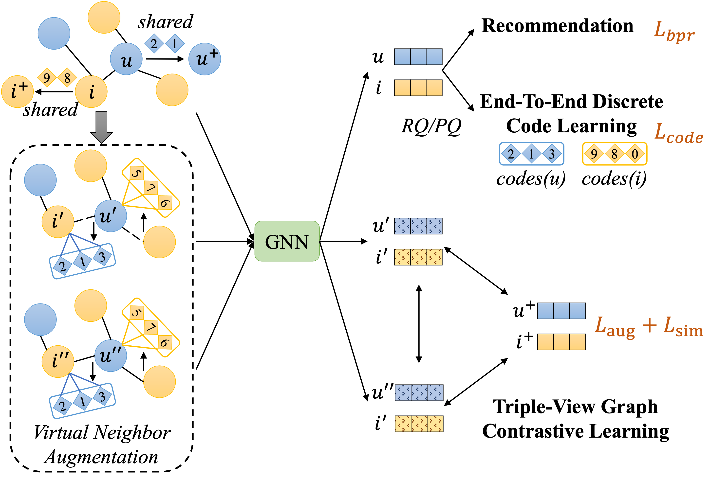

# CoGCL

This is the official PyTorch implementation for the paper:

> Enhancing Graph Contrastive Learning with Reliable and Informative Augmentation for Recommendation

## Overview

In this paper, we propose CoGCL, a reliable and informative graph CL approach aiming to construct contrastive views that imply stronger collaborative information by introducing discrete codes. To map users and items into discrete codes rich in collaborative information, we learn a multi-level vector quantizer in an end-to-end manner to quantize user and item representations encoded by GNN into discrete codes. Subsequently, the learned discrete codes are adopted to enhance the collaborative information of contrastive views in two aspects: neighborhood structure and semantic relevance. For neighborhood structure, we conduct virtual neighbor augmentation by treating discrete codes as virtual neighbors based on existing interactions. This process serves to enhance the node’s neighbor information and alleviate interaction sparsity in contrasting views. For semantic relevance, we identify users/items that share discrete codes or interaction targets as semantically similar for positive sampling. By aligning users/items with semantic relevance via CL, we can further enhance the integration of collaborative semantics. Through the above strategies, we can generate various contrastive views with stronger collaborative information. Finally, a triple-view graph contrastive learning approach is proposed to achieve alignment across the augmented nodes and similar users/items. 



## Requirements

```
torch==2.2.1+cu124
recbole
pyg
```

## Datasets

You can find all the datasets we used in [Google Drive](https://drive.google.com/file/d/1uo-aZ9V5SGQGkJkptprGEyk4vdKjj_6N/view?usp=sharing). Please download the file and unzip it to the current folder. Each dataset contains the following files:

```
dataset_name/
├── dataset_name.inter
├── dataset_name.train.inter
└── dataset_name.valid.inter
└── dataset_name.test.inter
```

Among them, `.inter` is all user-item interactions, while `.train.inter`,`.valid.inter`,`.test.inter`  are the training, validation and test sets respectively, split in a ratio of 8:1:1.

## Quick Start

Hyperparameter search on different datasets:

```shell
cd run
bash run_hyper_alibaba.sh
bash run_hyper_gowalla.sh
bash run_hyper_instrument.sh
bash run_hyper_office.sh
```

Conduct a single experiment on a dataset:

```shell
cd run
bash run.sh
```

